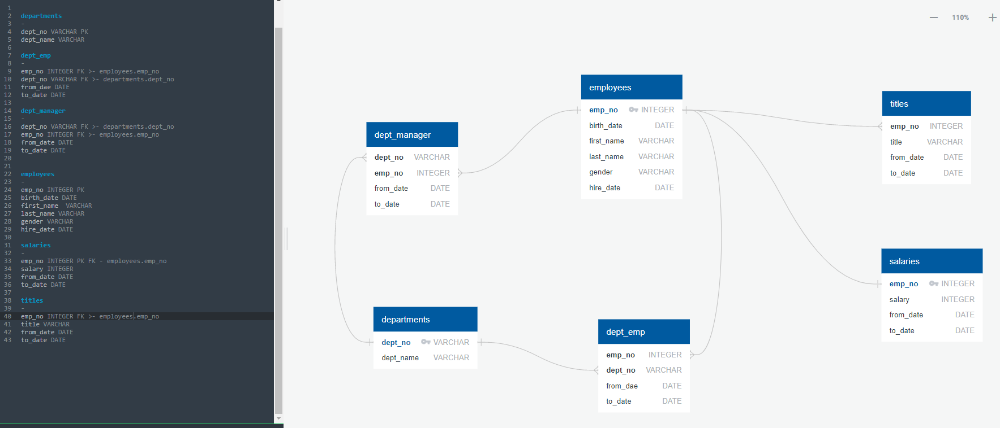
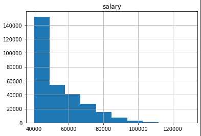
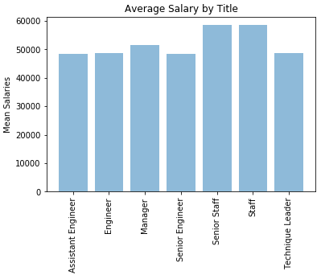

# sql-challenge
## Summary ##
This project is designed to set up tables to hold data in the CSVs, import the CSVs into s SQL database. ERD was created by using a tool from [http://www.quickdatabasediagrams.com](http://www.quickdatabasediagrams.com). Data Modeling, Data Engineering, and Data analysis are performed.
## Data Source ##
[CSVs](EmployeeSQL/data/) 
## Tool ##
Python, PostgreSQL
## Visualization ##
 
 
 
### Contact
Email: xinlianghuang85@gmail.com